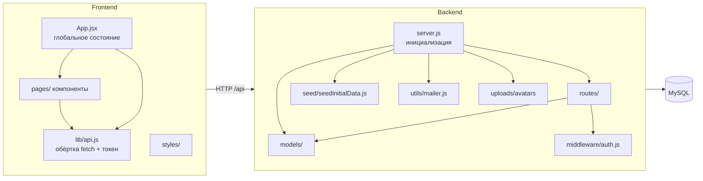
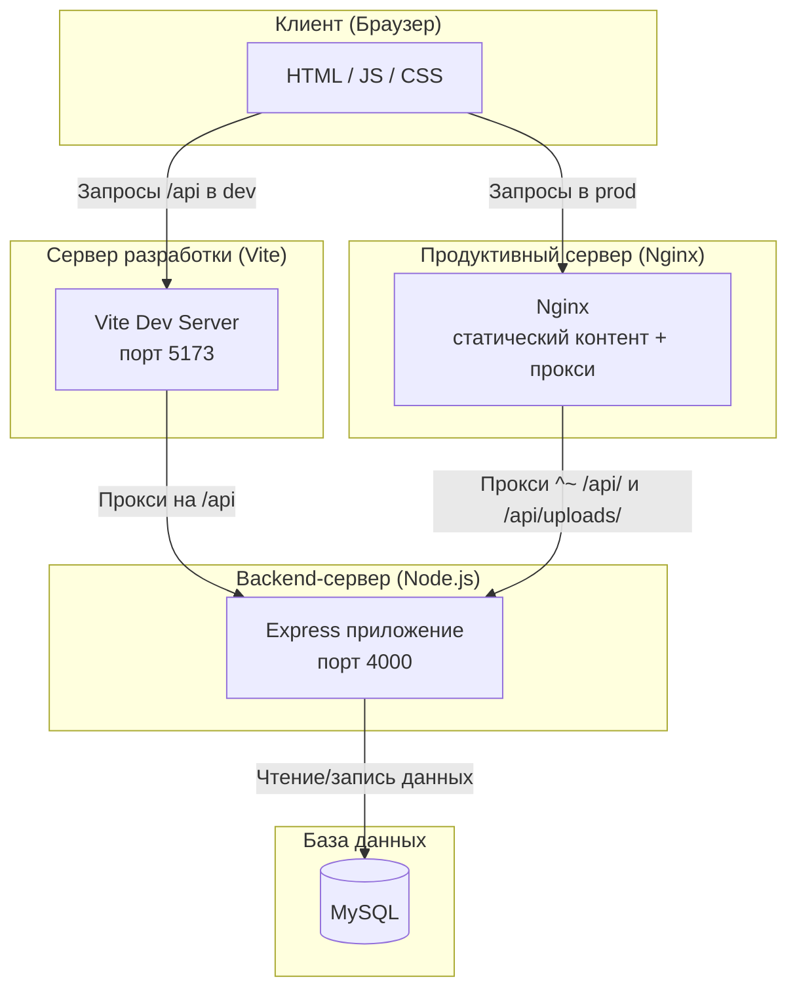
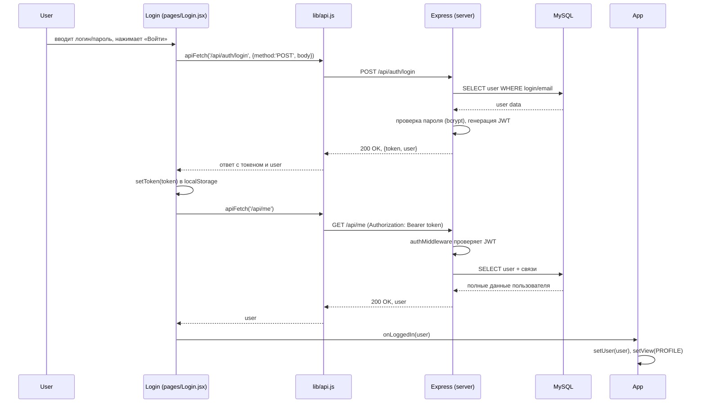

# SyharikFinance — образовательный симулятор по финансовой грамотности

Веб-приложение для обучения детей и подростков основам финансов: накопление, бюджет, предпринимательство, инвестиции. Игровой формат: сценарии-новеллы с выборами, квизы, симулятор бизнеса, торговля акциями и игра «Остров сокровищ». Есть интеграция с Telegram-ботом: прогресс синхронизируется между сайтом и ботом, сценарии можно проходить и в браузере, и в чате.

---

## О проекте

**SyharikFinance** — веб-приложение (SPA) с бэкендом на Node.js и базой MySQL. Пользователь регистрируется, подтверждает email, входит в профиль и получает доступ к карте сценариев. Каждый сценарий — отдельная механика: визуальная новелла по дням, квиз с баллами или симулятор с сохранением состояния. Прогресс, достижения, алмазы и опыт сохраняются на сервере. В профиле можно привязать Telegram: тогда тот же аккаунт доступен в боте, а прохождение сценариев (велосипед, квиз, лимонад) можно продолжать и на сайте, и в боте с автосохранением.

---

## Главные фишки проекта

- **Регистрация и верификация email** — код подтверждения по почте (SMTP или вывод в консоль в dev). Без верификации вход невозможен.
- **Профиль пользователя** — имя, логин, email, смена пароля, загрузка аватара (multer, статика в `/api/uploads/avatars`). В профиле отображаются алмазы, опыт, достижения и прогресс по сценариям. В профиле можно привязать или отвязать Telegram — после привязки в боте прогресс синхронизируется с сайтом.
- **Карта сценариев** — список сценариев из БД; первые два открыты бесплатно, остальные разблокируются за 25 алмазов. Есть активное прохождение (run) — можно «Продолжить» или начать заново.
- **Пять типов сценариев:**
  - **Мечта о велосипеде** (bike_dream) — 30 дней, накопить 5000 монет; рандомные события в части дней; выборы с delta по бюджету.
  - **День рождения друга** (friend_birthday) — распределение бюджета на подарок и развлечения.
  - **Финансовый квиз** (money_quiz) — вопросы с баллами, прохождение по результату.
  - **Мой первый бизнес** (lemonade_business) — 30 дней киоска с лимонадом; популярность, аренда, сюжетные и рандомные события; цель 5000 монет на смартфон.
  - **Инвестиционная гонка** (investment_race) — 20 ходов, покупка/продажа активов, цель — максимизировать капитал.
- **Игра «Остров сокровищ»** — отдельный экран из профиля; симулятор колонии: ресурсы (еда, дерево, камень, монеты), поселенцы, постройки, события; состояние хранится в БД (один слот на пользователя).
- **Сложность «Новичок» / «Знаток»** — переключается на карте; влияет на подсказки в сценариях и на игру «Остров».
- **Система достижений** — за прохождение сценариев (например, «Железная выдержка» за велосипед без трат); начисление XP (+50 за первое прохождение) и алмазов (+25 за первое успешное прохождение). Награды начисляются только при реальном прохождении до конца (проверка dayIndex) и только один раз.
- **Таблица лидеров** — топ по опыту или по алмазам на главной странице.
- **Telegram-бот** — привязка аккаунта по коду из профиля; просмотр прогресса и списка сценариев; прохождение в боте сценариев «Мечта о велосипеде», «Финансовый квиз» и «Мой первый бизнес (лимонад)» с выбором «продолжить с сохранения» или «начать заново»; выход из сценария с автосохранением (`/exit`). Команды: `/start`, `/link КОД`, `/play`, `/exit`, `/progress`, `/scenarios`, `/help`.

---

## Архитектура проекта:
Схема модулей back/front

Схема работы в dev и prod режиме


Схема логина пользователя

## Стек технологий

| Часть       | Технологии |
|------------|------------|
| Frontend   | React 18, Vite, SWC |
| Backend    | Node.js, Express |
| БД         | MySQL, Sequelize (ORM) |
| Аутентификация | JWT (Bearer), bcrypt |
| Письма     | Nodemailer |
| Загрузка файлов | Multer |
| Прод       | Сборка Vite → `dist`, Nginx (статика + прокси `/api` на Node) |

---

## Требования

- Node.js 18+
- MySQL 8 (или 5.7) с кодировкой utf8mb4
- Для писем (опционально): SMTP-доступ

---

## Установка и запуск (локально)

### 1. Клонирование и зависимости

```bash
cd devhack
cd backend && npm install
cd ../frontend && npm install
```

### 2. База данных

Создай базу MySQL:

```sql
CREATE DATABASE devhack_game CHARACTER SET utf8mb4 COLLATE utf8mb4_unicode_ci;
```

### 3. Настройка backend

В `backend/` скопируй `.env.example` в `.env` и заполни:

```env
DB_HOST=localhost
DB_PORT=3306
DB_USER=root
DB_PASSWORD=твой_пароль
DB_NAME=devhack_game
PORT=4000

JWT_SECRET=длинный_секретный_ключ
NODE_ENV=development

# По желанию — SMTP (если пусто, код верификации выводится в консоль)
SMTP_HOST=
SMTP_PORT=587
SMTP_USER=
SMTP_PASS=
MAIL_FROM=no-reply@syharik.ru
```

### 4. Запуск

**Терминал 1 — backend:**

```bash
cd backend
npm start
```

Сервер поднимется на порту 4000, при старте выполнится `sequelize.sync()` и сид начальных данных (сценарии, достижения).

**Терминал 2 — frontend (dev):**

```bash
cd frontend
npm run dev
```

Открой [http://localhost:5173](http://localhost:5173). Запросы на `/api` проксируются на `http://localhost:4000`.

**Терминал 3 — Telegram-бот (опционально):**

```bash
cd backend
npm run bot
```

Нужны переменные `TELEGRAM_BOT_TOKEN`, `TELEGRAM_BOT_SECRET`, `API_BASE_URL` в `.env`. См. раздел «Интеграция с Telegram-ботом».

---

## Деплой (production)

### Подход

- Frontend собирается в статику (Vite build).
- Backend работает как Node-процесс (например, под systemd или PM2).
- Nginx: раздаёт статику из каталога сборки и проксирует `/api` и `/api/uploads` на Node.

### Шаги

1. **Сборка фронтенда**

   ```bash
   cd frontend
   npm ci
   npm run build
   ```

   Результат в `frontend/dist/` (index.html и папка `assets/`).

2. **Выкладка статики на сервер**

   Скопируй содержимое `frontend/dist/` в корень сайта Nginx (в примере `nginx.conf` — `/var/www/admin107_fvd_usr/data/www/admin107.fvds.ru`).

3. **Backend на сервере**

   - Скопируй папку `backend/` (без `node_modules`).
   - На сервере: `cd backend && npm ci --omit=dev`.
   - Создай `.env` с продакшен-значениями: `DB_*`, `PORT=4000`, `JWT_SECRET`, `NODE_ENV=production`, при необходимости SMTP и переменные для Telegram-бота (см. таблицу выше).

4. **Запуск Node**

   Пример через PM2:

   ```bash
   cd /path/to/backend
   pm2 start src/server.js --name devhack-api
   pm2 save
   ```

   Если используешь Telegram-бота, запусти его отдельно: `pm2 start telegram-bot/bot.js --name devhack-bot` (из каталога backend) или `npm run bot` в отдельном процессе.

   Или через systemd: unit с `ExecStart=node src/server.js` в каталоге backend.

5. **Nginx**

   В конфиге виртуального хоста:

   - `root` — путь к собранному фронту (где лежит `index.html`).
   - `location /` — `try_files $uri $uri/ /index.html;` (SPA).
   - `location ^~ /api/` — `proxy_pass http://127.0.0.1:4000;` с заголовками `Host`, `X-Real-IP`, `X-Forwarded-For`, `X-Forwarded-Proto`.
   - `location ^~ /api/uploads/` — тот же proxy_pass на backend (раздача аватаров).

   Пример такого конфига лежит в корне проекта: `nginx.conf`.

6. **SSL**

   Включи HTTPS (Let's Encrypt или свой сертификат) и редирект с HTTP на HTTPS, как в нижнем блоке `server { listen 80; return 301 https://... }` в `nginx.conf`.

7. **Проверка**

   - Открыть сайт по домену — загрузка SPA.
   - Вход/регистрация — запросы уходят на `/api/auth/*`.
   - После входа — профиль, карта сценариев, прохождение — всё через `/api/*`.

---

## Переменные окружения (backend)

| Переменная | Описание |
|------------|----------|
| `DB_HOST`, `DB_PORT`, `DB_USER`, `DB_PASSWORD`, `DB_NAME` | Подключение к MySQL |
| `PORT` | Порт API (по умолчанию 4000) |
| `JWT_SECRET` | Секрет для подписи JWT (обязателен) |
| `NODE_ENV` | `development` / `production` |
| `SMTP_HOST`, `SMTP_PORT`, `SMTP_USER`, `SMTP_PASS`, `MAIL_FROM` | Письма верификации (необязательно) |
| `TELEGRAM_BOT_TOKEN` | Токен бота от @BotFather (для интеграции с Telegram) |
| `TELEGRAM_BOT_SECRET` | Секрет для проверки запросов от бота (тот же в backend и в боте) |
| `TELEGRAM_BOT_USERNAME` | Юзернейм бота без @ (например `SyharikFinanceBot`) — для отображения в подсказках |
| `API_BASE_URL` | URL API для бота (в dev: `http://localhost:4000`; на том же сервере можно `http://127.0.0.1:4000`) |
| `WEB_APP_URL` | URL веб-приложения (для ссылок «продолжить на сайте» в боте) |
| `ALLOW_SELF_SIGNED_SSL` | Если API по HTTPS с самоподписным сертификатом — `true` (бот сможет вызывать API) |

---

## Интеграция с Telegram-ботом

Прогресс по сценариям синхронизируется между сайтом и Telegram: можно начать сценарий на сайте, остановиться — и продолжить в том же месте в боте (или наоборот). Один аккаунт — один прогресс.

**Как включить:**

1. Создай бота в Telegram через [@BotFather](https://t.me/BotFather), получи токен.
2. В `backend/.env` добавь:
   - `TELEGRAM_BOT_TOKEN=...` — токен бота
   - `TELEGRAM_BOT_SECRET=...` — длинный секретный ключ (тот же использует бот при вызовах API)
   - `TELEGRAM_BOT_USERNAME=SyharikFinanceBot` (или твой юзернейм бота)
   - `API_BASE_URL=http://localhost:4000` (в проде — URL API; если бот на том же сервере — можно `http://127.0.0.1:4000`)
   - `WEB_APP_URL=https://твой-сайт.ru` (в проде — URL фронта)
   - при самоподписном HTTPS: `ALLOW_SELF_SIGNED_SSL=true`
3. Запуск бота из папки backend: `npm run bot`.

**Привязка аккаунта:** в профиле на сайте нажми «Привязать Telegram», получи код и отправь боту команду `/link КОД`. После привязки в профиле на сайте отобразится «К этому профилю привязан Telegram: @username» (обнови страницу при необходимости).

**Команды бота:**

| Команда | Описание |
|--------|----------|
| `/start` | Приветствие и краткая подсказка |
| `/link КОД` | Привязать аккаунт (код из профиля на сайте) |
| `/play` | Выбрать сценарий и играть в боте. Если есть сохранение — предложит продолжить (1) или начать заново (2). Доступны: 1 — Мечта о велосипеде, 2 — Финансовый квиз, 3 — Мой первый бизнес |
| `/exit` | Выйти из сценария с сохранением прогресса |
| `/progress` | Алмазы, опыт, пройденные и текущие сценарии |
| `/scenarios` | Список всех сценариев и ссылка на сайт |
| `/help` | Список всех команд с описанием |

---

## Скрипты для администрирования (ручной запуск на сервере)

Запускать из папки `backend/`. **Проект может быть включён или выключен** — скрипты работают с БД напрямую. После удаления пользователей их сессии станут недействительными при следующем запросе к API.

- **Сброс алмазов**  
  `node scripts/reset-gems.js` — показать, кому обнулятся алмазы;  
  `node scripts/reset-gems.js --confirm` — обнулить **всем**;  
  `node scripts/reset-gems.js --confirm --user=иванов` — только у кого логин/имя содержат «иванов»;  
  `node scripts/reset-gems.js --confirm --id=5` или `--id=1,5,9` — только пользователям с указанными ID (без совпадений по имени).

- **Удаление пользователей и связанных данных**  
  `node scripts/delete-all-users.js` — показать план;  
  `node scripts/delete-all-users.js --confirm` — удалить **всех**;  
  `node scripts/delete-all-users.js --confirm --user=тест` — только у кого логин/имя содержат «тест»;  
  `node scripts/delete-all-users.js --confirm --id=3` или `--id=2,4,6` — только пользователям с указанными ID.

Поиск: `--user=` — по подстроке логина/имени (регистронезависимый); `--id=` — точный выбор по ID (несколько через запятую). Можно комбинировать `--id=` и `--user=`. Без `--confirm` скрипты только выводят список и не меняют данные.

---

## Структура репозитория (кратко)

```
devhack/
├── frontend/           # React SPA (Vite)
│   ├── src/
│   │   ├── App.jsx
│   │   ├── lib/api.js
│   │   ├── pages/      # Login, Register, VerifyEmail, Profile, ScenarioMap, сценарии, IslandGame
│   │   ├── components/
│   │   └── styles/
│   ├── vite.config.mjs
│   └── package.json
├── backend/            # Express API
│   ├── scripts/        # reset-gems.js, delete-all-users.js (ручной запуск)
│   ├── src/
│   │   ├── server.js
│   │   ├── config/database.js
│   │   ├── models/
│   │   ├── routes/     # auth, me, runs, botScenario, telegram, ...
│   │   ├── middleware/
│   │   ├── data/botScenarios/  # контент сценариев для бота (bike, quiz, lemonade)
│   │   ├── seed/
│   │   └── utils/mailer.js
│   ├── uploads/avatars/
│   ├── telegram-bot/   # Telegram-бот (npm run bot)
│   │   └── bot.js
│   ├── .env.example
│   └── package.json
├── nginx.conf          # Пример конфига Nginx для деплоя
└── README.md

```

